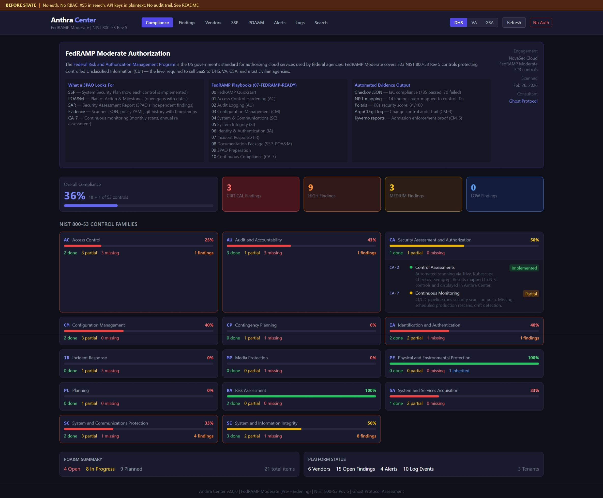
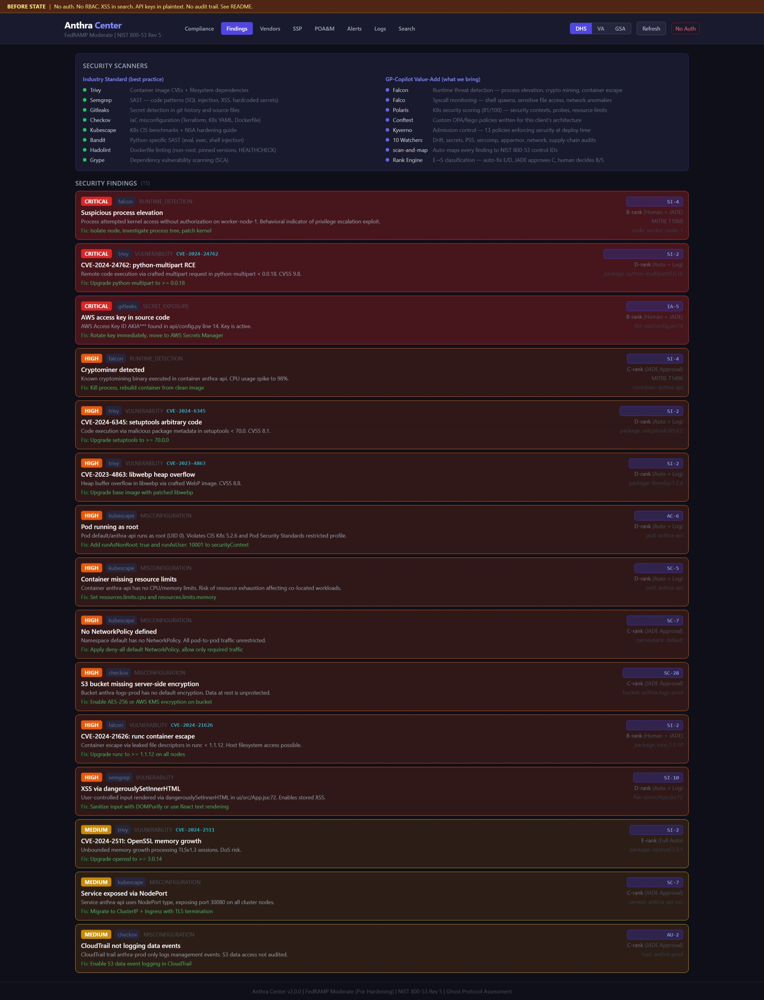
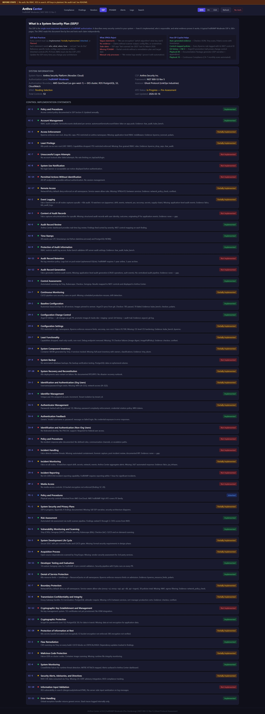
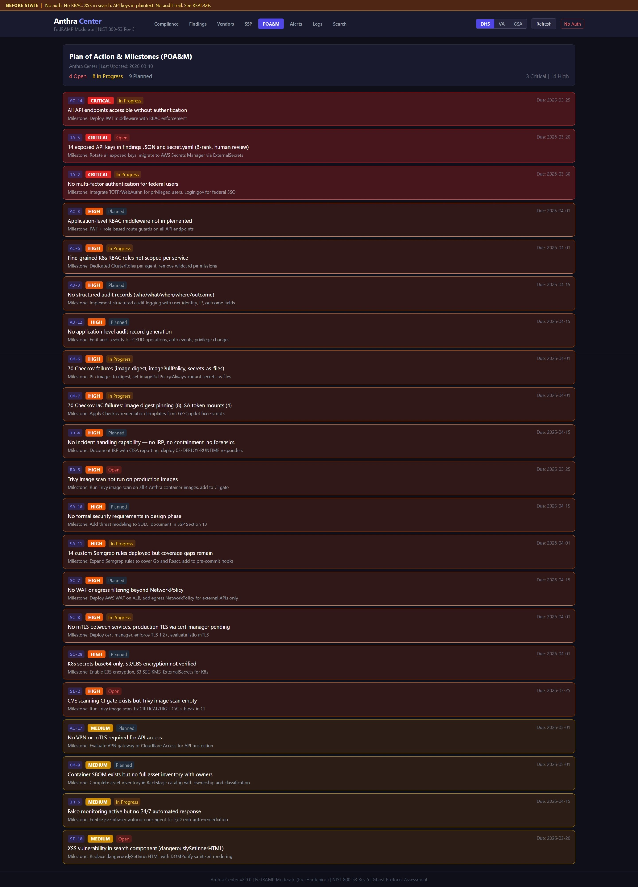

# Anthra Security Platform

**Client:** Anthra Security Inc. (NovaSec Cloud)
**Engagement:** FedRAMP Moderate Authorization
**Consultant:** Ghost Protocol (LinkOps Industries)
**Objective:** Achieve FedRAMP Moderate authorization to sell to federal agencies (DHS, VA, GSA)

> **DEMO CONTEXT:** This is a realistic FedRAMP engagement. Security gaps in the BEFORE state are intentional — they represent a startup that built for speed and now needs federal hardening. GP-Copilot packages remediate these gaps.

---

## About Anthra

Anthra Security is a cloud-native security monitoring and log aggregation SaaS platform. Think lightweight Splunk for containerized environments.

- 25 employees, Series A ($8M)
- 150+ commercial customers
- Stack: Python (FastAPI), Go, React, PostgreSQL on EKS
- **Business goal:** Win federal contracts requiring FedRAMP Moderate

---

## What is FedRAMP?

**Federal Risk and Authorization Management Program** — the US government's standard for authorizing cloud services used by federal agencies.

| Level | Controls | Data Sensitivity | Examples |
|-------|----------|-----------------|----------|
| Low | 125 | Public/non-sensitive | Public websites, open data |
| **Moderate** | **323** | **Controlled Unclassified (CUI)** | **SaaS sold to DHS, VA, GSA** ← Anthra |
| High | 421 | National security | DoD, intelligence community |

**Anthra targets Moderate** — 323 NIST 800-53 Rev 5 controls across 20 control families.

### What a 3PAO Looks For

A **Third-Party Assessment Organization (3PAO)** audits your system before FedRAMP grants an Authority to Operate (ATO). They evaluate:

| Document | What It Is | What They Check |
|----------|-----------|-----------------|
| **SSP** (System Security Plan) | 300+ page document describing every control | Is each control implemented, partially implemented, or planned? |
| **POA&M** (Plan of Action & Milestones) | Tracking sheet for gaps | Are open items prioritized with owners, dates, and remediation plans? |
| **SAR** (Security Assessment Report) | 3PAO's own findings | Did their independent testing match your SSP claims? |
| **Control Matrix** | Mapping of controls → evidence | Can you prove each control with scanner output, config files, or screenshots? |
| **Continuous Monitoring** | Monthly vulnerability scans + annual re-assessment | Are you maintaining posture post-ATO? (CA-7) |

**Key formats 3PAOs expect:**

- Control evidence tied to NIST control IDs (AC-2, SC-7, etc.)
- Scanner output with timestamps (Checkov JSON, Trivy JSON, Kubescape)
- Policy-as-code artifacts (OPA/Rego, Kyverno YAML) proving enforcement
- Git history proving change control (CM-3)
- Audit logs proving monitoring (AU-2, AU-12, SI-4)

---

## Dashboard









---

## Compliance Posture — Real Scan Data (Feb 26, 2026)

Scanned with: `GP-CONSULTING/07-FEDRAMP-READY/tools/run-fedramp-scan.sh` + `scan-and-map.py`

### Control Coverage (26 controls assessed)

| Status | Count | Meaning |
|--------|-------|---------|
| MET | 5 | Full evidence, scanner-validated |
| PARTIAL | 18 | Some evidence, gaps remain |
| MISSING | 3 | No evidence, must implement |
| Total assessed | 26 / 323 | Priority controls only (Phase 1) |

### Controls by Family

| Family | Controls | MET | PARTIAL | MISSING |
|--------|----------|-----|---------|---------|
| AC — Access Control | AC-2, AC-3, AC-6, AC-17 | 1 | 3 | 0 |
| AU — Audit & Accountability | AU-2, AU-3, AU-9, AU-12 | 1 | 1 | 2 |
| CM — Configuration Management | CM-2, CM-6, CM-7, CM-8 | 1 | 3 | 0 |
| IA — Identification & Authentication | IA-2, IA-5 | 1 | 1 | 0 |
| IR — Incident Response | IR-4, IR-5 | 0 | 1 | 1 |
| RA — Risk Assessment | RA-2, RA-5 | 0 | 1 | 0 |
| SA — System Acquisition | SA-10, SA-11 | 0 | 2 | 0 |
| SC — System & Comms Protection | SC-5, SC-7, SC-8, SC-28 | 1 | 3 | 0 |
| SI — System Integrity | SI-2, SI-3, SI-4 | 0 | 3 | 0 |

### Scanner Results

**Checkov (IaC + Dockerfile):**
- 785 passed / 70 failed / 0 skipped
- Top failures: image digest pinning (8), imagePullPolicy (8), secrets-as-files (5), SA token mounts (4)

**NIST Mapping (Trivy + Semgrep + Gitleaks):**
- 14 findings, all mapped to IA-5 (Authenticator Management)
- All rank B (human review required — exposed API keys in findings JSON and secret.yaml)

**Cluster Audit (Polaris):**
- Score: 81/100
- 22 pods without resource limits
- 14 namespaces without NetworkPolicy

### POA&M Summary (21 Open Items)

| Priority | Count | Examples |
|----------|-------|---------|
| HIGH | 18 | AU-12 (no audit generation), IR-4 (no incident handling), IA-5 (14 exposed secrets) |
| MEDIUM | 3 | AC-17 (network segmentation gaps), CM-8 (incomplete inventory), IR-5 (monitoring gaps) |

Full reports: `GP-S3/5-consulting-reports/01-instance/slot-3/07-package/fedramp-20260226/`

---

## How GP-Copilot Accelerates FedRAMP

### Industry Standard (what any consultant does)

- Run Checkov, Trivy, Kubescape scans
- Map findings to NIST 800-53 controls manually
- Write SSP in Word documents
- Track POA&M in spreadsheets
- Collect evidence screenshots by hand
- Repeat for every annual re-assessment

### GP-Copilot Value-Add (what we automate)

| Tool | What It Does | NIST Controls |
|------|-------------|---------------|
| `run-fedramp-scan.sh` | Runs all scanners in parallel, outputs JSON evidence | RA-5, SA-11 |
| `scan-and-map.py` | Auto-maps findings to NIST control IDs | RA-5, CA-2 |
| `gap-analysis.py` | Generates control matrix + POA&M + remediation plan in one run | CA-2, CA-5 |
| `fix-cluster-security.sh` | Auto-fixes PSS, NetworkPolicy, LimitRange across all namespaces | AC-6, SC-7, CM-6 |
| `create-app-deployment.sh` | Stamps out hardened Kustomize deployments (non-root, drop ALL, seccomp) | AC-6, CM-2, CM-7 |
| `promote-image.sh` | Git-based promotion = CM-3 change control audit trail | CM-3, CM-5 |
| `deploy-policies.sh` | Kyverno admission control prevents non-compliant deployments | CM-6, SI-7 |
| `deploy.sh` (Falco) | Runtime threat detection for continuous monitoring | AU-2, AU-12, SI-4, IR-5 |
| `cleanup-orphaned-secrets.sh` | Detect and remove unused secrets | IA-5, SC-28 |

**The output is what 3PAOs want:** JSON scan results with timestamps, NIST control IDs on every policy, git history for change control, and automated evidence collection. Not screenshots and Word docs.

### Engagement Phases

| Phase | Focus | GP-Copilot Package | Status |
|-------|-------|-------------------|--------|
| 1 | Code & container scanning | `01-APP-SEC` | Done (Feb 12) |
| 2 | Cluster hardening & policies | `02-CLUSTER-HARDENING` | Done (Mar 16) |
| 3 | Runtime monitoring | `03-DEPLOY-RUNTIME` | In progress |
| 4 | Gap analysis & control mapping | `07-FEDRAMP-READY` | Done (Feb 26) |
| 5 | Evidence collection & 3PAO prep | `07-FEDRAMP-READY` (Phase 2) | Planned |

---

## Architecture

```
┌─────────────────────────────────────────────────────────────┐
│                    ANTHRA PLATFORM                           │
├─────────────────────────────────────────────────────────────┤
│                                                             │
│   UI Layer           API Layer          Ingest Layer        │
│   ─────────          ─────────          ──────────          │
│                                                             │
│   React              FastAPI            Go Service          │
│   Dashboard    ←──▶  (Python)     ←──▶  Log Ingest         │
│   (Port 8080)        (Port 8080)        (Port 9090)        │
│                           │                  │              │
│                           └──────┬───────────┘              │
│                                  ▼                          │
│                            PostgreSQL                       │
│                            (Port 5432)                      │
│                                                             │
│   Security Layer (GP-Copilot)                               │
│   ─────────────────────────────                             │
│   Kyverno (admission)  │  Falco (runtime)  │  ArgoCD (GitOps)
│   13 policies enforce  │  2 nodes monitor  │  12 apps sync  │
│                                                             │
└─────────────────────────────────────────────────────────────┘
```

---

## Directory Structure

```
Anthra-FedRAMP/
├── README.md                        # This file
├── PRE-DEPLOYMENT-IMPLEMENTATION.md # Full implementation guide
├── docker-compose.yml               # Local development stack
│
├── api/                             # Python FastAPI application
├── services/                        # Go log-ingest microservice
├── ui/                              # React dashboard
├── db/                              # Database initialization
├── docs/                            # Engagement documentation
├── policies/                        # App-level OPA policies
├── scripts/                         # App scripts
│
├── infrastructure/                  # Kustomize + Terraform (ArgoCD-managed)
│   ├── anthra-api/                  # base/ + overlays/dev|staging|prod + argocd/
│   ├── anthra-ui/
│   ├── anthra-log-ingest/
│   ├── anthra-db/
│   └── terraform/                   # EKS infrastructure (VPC, IAM, RDS, S3)
│
└── GP-Copilot/                      # Ghost Protocol engagement artifacts
    ├── README.md                    # Engagement overview + package status
    ├── jsa-variant-sums/            # Agent cheatsheet
    ├── 01-package/                  # APP-SEC — scans, fixer scripts, CI templates
    │   ├── outputs/                 # Scan report (Feb 12)
    │   ├── fixer-scripts/           # Security contexts, secrets mgmt, MD5→bcrypt
    │   ├── ci-templates/            # GitHub Actions security gates
    │   └── playbooks/01-05
    ├── 02-package/                  # CLUSTER-HARDENING — policies, golden path
    │   ├── conftest-policies/       # OPA/Rego policies written for Anthra
    │   ├── kyverno-policies/        # Kyverno admission rules for Anthra
    │   └── playbooks/01-05
    ├── 03-package/                  # DEPLOY-RUNTIME — Falco, watchers
    │   └── playbooks/01-05
    └── 07-package/                  # FEDRAMP-READY — SSP, gap analysis
        ├── outputs/                 # SSP appendix, remediation templates
        └── playbooks/01-03
```

**Reports:** `GP-S3/5-consulting-reports/01-instance/slot-3/` (01-package through 07-package)

---

## Quick Start

```bash
# Start the platform locally
docker compose up -d

# Access UI
kubectl port-forward svc/novasec-ui -n anthra 8080:8080 &
open http://localhost:8080

# Check API health
curl http://localhost:8080/api/health

# Run FedRAMP gap analysis
PKG=~/linkops-industries/GP-copilot/GP-CONSULTING/07-FEDRAMP-READY
python3 $PKG/tools/gap-analysis.py --target . --output /tmp/gap-analysis/

# Promote image (dev → staging → prod)
PKG=~/linkops-industries/GP-copilot/GP-CONSULTING/02-CLUSTER-HARDENING
bash $PKG/tools/platform/promote-image.sh --app anthra-api --from dev --to staging
```

---

## Contact

**Anthra Security Inc.** — NovaSec Cloud Division
**Ghost Protocol** — FedRAMP Practice (LinkOps Industries)
Engagement managed via `GP-CONSULTING/07-FEDRAMP-READY/`

---

*Built with speed. Hardened with Ghost Protocol. FedRAMP-ready with GP-Copilot.*
